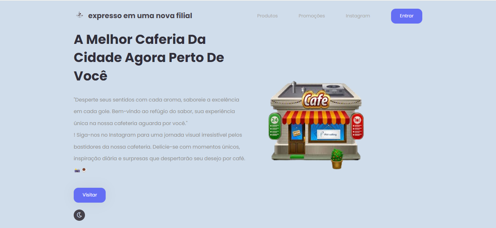

# ladingpage

 # descrição 
 fazer uma landing page para um novo negócio que está abrindo na Saul Elkind, uma cafeteria. A ideia da landing page é oferecer promoções e anunciar os produtos e serviços desse novo negócio aos potenciais consumidores da região. A empresa usará sua landing page para divulgar o início das operações do negócio pelo instagram institucional.]
 

# indrodução 
  o objetivo é divulgar informações sobre a nova cafeteria na saul elkind

# funcionalidades
  pagina inicial de uma cafeteria 
  facilitar o acesso de diferente páginas
  
# tecnologias utilizadas 
**html5** 
**css**
**java script**

# fontes consultadas 
ogle:** Utilizamos o Google como fonte de inspiração e pesquisa.    
**Visual Studio Code:** Ferramenta de desenvolvimento integrada para codificação eficiente.   
**GitHub:** Repositório para o controle de versão do código-fonte.    
**JavaScript:** Linguagem de programação para interatividade e dinamismo.   
**HTML & CSS:** Estrutura e estilo para a construção da Landing Page.   
# autores 
  feito por julia de lima machado santos.

 
  